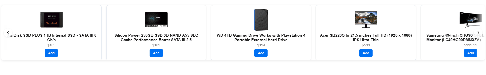

<p align="center">
  
</p>

<h1 align="center">Vue Embeddable E-commerce Widget</h1>

<p align="center">
  🚀 Vue 3 + Vite-powered, 5-item infinite carousel widget that you can embed anywhere
</p>

---

# 📦 Project Overview

This project is an embeddable **Vue 3** widget built with **Vite** that provides:

- ✅ A **5-item** horizontal carousel per viewport  
- ✅ **Prev/Next** buttons with smooth infinite looping  
- ✅ Fully **responsive** (desktop → tablet → mobile)  
- ✅ **Scoped CSS** injected at runtime (no separate CSS file)  
- ✅ Bundled as a **single IIFE** (`widget.min.js`) for easy embedding  
- ✅ **HMR** during development with `npm run dev`  
- ✅ **CDN-ready** production bundle  

---

# 🎯 Features

| Feature                         | Status |
|---------------------------------|:------:|
| Vue 3 Single-File Components    | ✅ |
| Vite Dev Server + HMR           | ✅ |
| 5 Items Per Viewport            | ✅ |
| Infinite Looping Carousel       | ✅ |
| CSS Injected by JS (no CSS file)| ✅ |
| Shadow DOM Isolation            | ✅ |
| Zero Runtime Dependencies       | ✅ |

---

# 🚀 Quick Start

### 1️⃣ Clone the repository

```bash
git clone https://github.com/your-username/vue-ecom-widget.git
cd vue-ecom-widget
```

### 2️⃣ Install dependencies

```bash
npm install
```

### 3️⃣ Start development server (HMR)

```bash
npm run dev
```

> Opens <http://localhost:5173/index.html> — edit `src/Widget.vue` and see live updates.

### 4️⃣ Build for production

```bash
npm run build
```

> Outputs a single `dist/widget.min.js` and copies `preview.html` into `dist/`.

### 5️⃣ Preview production build

```bash
npm run preview
```

> Opens <http://localhost:4173/preview.html> showing the bundled widget.

---

# 🛠 Usage Example

Embed in **any** HTML page:

```html
<div id="my-ecom-widget"></div>

<script src="https://your-cdn.com/widget.min.js"></script>
<script>
  window.EcomWidget.init({
    selector: '#my-ecom-widget',
    category: 'electronics',    // optional: API category
    visibleCount: 5             // optional: number of items to show
  });
</script>
```

✅ The Vue widget will mount itself into your page seamlessly.

---

# ✨ Widget Preview


---

# ⚙️ Configuration Options

| Property       | Type     | Default           | Description                              |
| -------------- | -------- | ----------------- | ---------------------------------------- |
| `selector`     | `string` | `#my-ecom-widget` | CSS selector where the widget mounts     |
| `category`     | `string` | `'electronics'`   | Fake Store API category to fetch         |
| `visibleCount` | `number` | `5`               | Number of cards visible per viewport     |

Example:

```js
window.EcomWidget.init({
  selector: '.restaurant-menu',
  category: 'jewelery',
  visibleCount: 5
});
```

---

# 📡 API Endpoints Used

- **GET** products by category:  
  `https://fakestoreapi.com/products/category/{category}`  
- **POST** add to cart:  
  `https://fakestoreapi.com/carts`

*(Free public test API — no API key required.)*

---

# 🧩 Technology Stack

- **Vue 3** with `<script setup>` SFCs  
- **Vite** for dev server, HMR & build  
- **vite-plugin-css-injected-by-js** (inlines CSS into JS)  
- **ESBuild** minification  
- No external runtime dependencies  

---

# 📁 Project Structure

```text
vue-ecom-widget/
├── src/
│   ├── main.js         # Entry: exposes window.EcomWidget.init
│   └── Widget.vue      # Vue component for the carousel
├── public/
│   ├── index.html      # Dev HMR entry
│   └── preview.html    # Production preview page
├── assets/
│   └── demo.min.gif    # Animated demo GIF
├── vite.config.js      # Vite + CSS-injected-by-JS config
├── package.json        # npm scripts & dependencies
└── dist/               # Output after `npm run build`
    ├── widget.min.js   # Single IIFE bundle (code + CSS)
    └── preview.html    # Copied preview for production
```

**.gitignore** example:

```gitignore
node_modules/
dist/
.DS_Store
.vscode/
.env
```

---

# 📜 License

**MIT License**

Feel free to use, modify, distribute, and contribute!

---

# 🤝 Contributing

Pull requests are welcome! For major changes, please open an issue to discuss first.

1. Fork the repo  
2. Create a feature branch (`git checkout -b feature/...`)  
3. Commit your changes (`git commit -m "feat: ..."`)  
4. Push to your branch (`git push origin feature/...`)  
5. Open a Pull Request  

---

# 📬 Contact

- 🌐 [LinkedIn](https://www.linkedin.com/in/oliver-t-8a28b070/)  
- 🐦 [GitHub](https://github.com/SchnapsterDog)  
- 📩 Email: oliver@akrinum.com  

---

<p align="center">Made with ❤️ and Vue 3</p>
